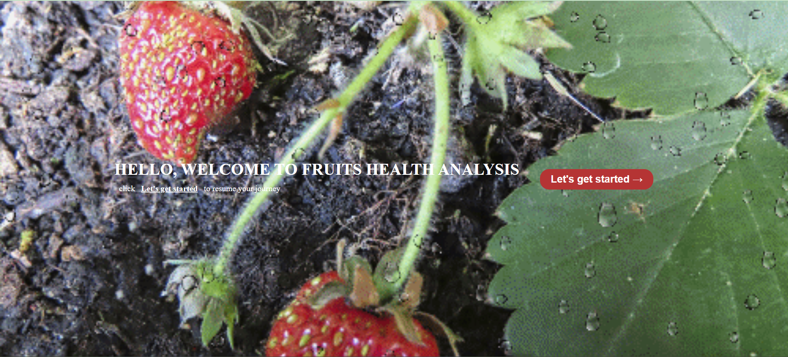
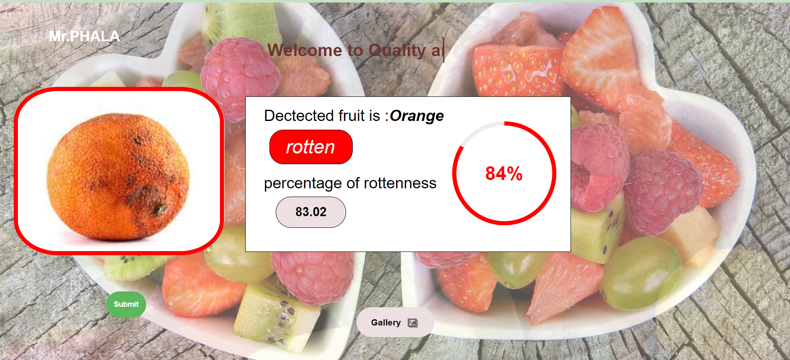
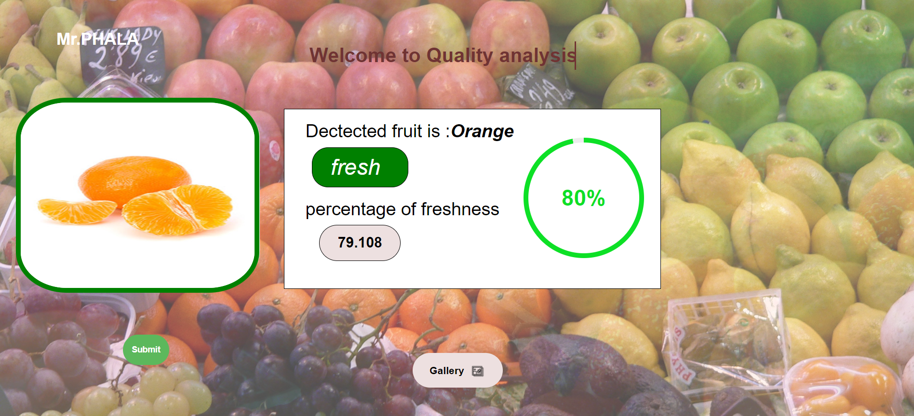

<h2>This is Assessment of Fruit Health Analysis using Ai by MobileNet V2 with over 95% accuracy</h2>

<h3>Introduction</h3>

Our project aims to predict the name of a given fruit and its freshness percentage through input images or by granting permission to access the camera.

1.We utilized Keras as the backbone for our project, ensuring robustness in our models.
2.The model was trained on 10,000 images, primarily sourced from Kaggle notebooks.
3.We integrated our application with OpenCV so that users can make real-time predictions by allowing camera access.

<h3>Technologies/Requirements</h3>
Flask 2.3.2 or later
Keras 2.13.1 or later
NumPy 1.24.3 or later
TensorFlow 2.13.0 or later
TensorFlow-Intel 2.13.0 or later

lets give me an example of our UI.

*This is the introduction of our web application. Click on "Let's get started" to continue.*

*This image shows a fruit detected by our model as a Rotten Orange with the percentage of rottenness.*

*This image shows a fruit detected by our model as a Fresh Orange with the percentage of freshness.*

After successfully installing the requirements, run the file `ao1.py`. It will run on the development server [http://127.0.0.1:5000](http://127.0.0.1:5000).

